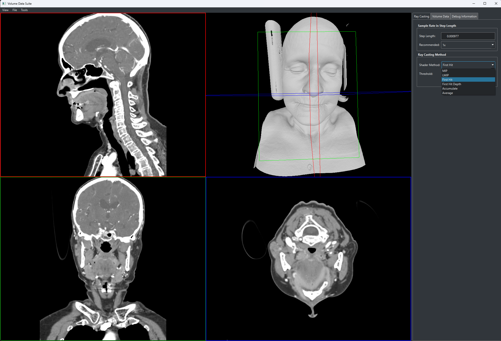
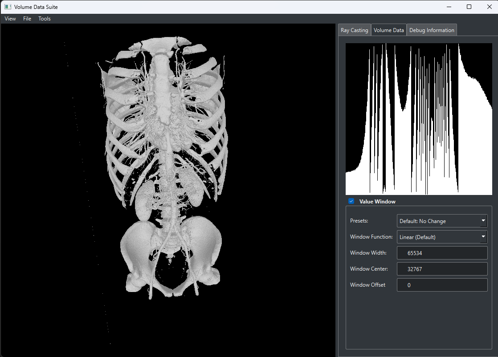

# Volume-Data-Suite

An interactive direct volume rendering application written in `C++`, `OpenQL` and utilizes `Qt` for the GUI.
Supports various raymarching techniques for medical imaging visualisations and includes various file format conversions, image data manipulation, various histogram algorithms, custom ISO value windowing and centering, 2D and 3D visualisations and shader editing during runtime.

## Preview

https://github.com/Volume-Data-Suite/vds-qt/assets/27208977/fff2eee1-8aac-4890-ab8b-126bb153b645
